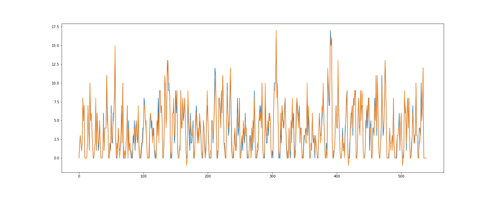
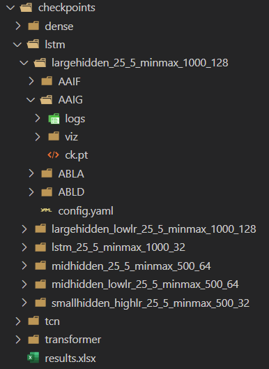
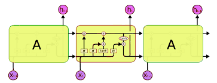
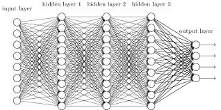
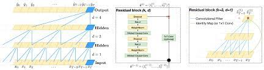
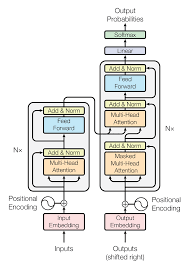

# Time Series Forecasting with Deep Learning Models

## Usage

This is my implementation of some shallow deep models (Dense, LSTM, TCN and Transformer Neural Networks) that should deal with our data.

To run with your options you just have to **modify the config file (config/config.yaml)** and run `train.py`.
It automatically create some folders for the experiment where it:
* saves the best checkpoint in "ck.pt" file
* saves the config for further reuse of the same option scheme
* generates a folder "logs" where it stores:
    * the train losses (`train.txt`)
    * the evaluation metrics (`test.txt`)
    * the best checkpoint (epoch and loss) (`ckpt.txt`)
    * the best checkpoint metrics (`metrics.txt`)
* generates a folder "viz" where it stores the comparisons Predicted vs. GT on test set like the following 
* fill a table `checkpoint/results.xlsx` with the name of the model used, some config parameters, and its performance. It will use xlsx sheets to separate results on each store
* first, third, forth and fifth bullets are computed for each store (in an appropriate folder)

The folder structure it will create is depicted below:

## Environment

You'll just need the following packages in your environment:

- pandas
- numpy
- yaml
- argparse
- datetime
- torch
- matplotlib
- openpyxl

At the present moment it just run on CPU (but i'll change it ASAP), but it doesn't take much time to run (6/7 minutes on 1000 epochs for LSTM and Dense model).

## Args

Here is the list of the arguments of the config.yaml file with a brief explanation

### Paths

| arg | type | help | modify |
|-----|------|------|--------|
|experiment_name | str | unique name to identify the exp. Should be representative of your config.yaml file| **yes** |
| path_to stores| str |path to the stores .xlsx | **no** |
| path_to_checkpoints | str | path where to save results | **no** |
| path_to_experiment | str | path to the main folder of the experiment | **no** |

### Dataset and Loader
| arg | type |help | modify |
|-----|------|-----|--------|
|stores_list| str="all" or List(str) |stores on which you want to train the selected model. The names in the list should match the identifiers of the stores. the key "all" enable training on all the stores in the dataset| **yes**|
|split_date| str, format="YYYY-MM-DD" |date on which split datasets in train (< split_date ) and test (> split_date)| **yes**|
|history_length| int | length of the moving window, this is how many values we feed in the network| **yes**|
|pred_length| int | length of the predictions, this is how many values we obtain from the network| **yes**|
|normalization_strategy| str |how to scale our data. It can be *minmax* or *standard*| **yes**|
|batchsize| int | batch size for the loader|**yes**|
|univariate| bool |it tells if the series is univariate| *NOT USED*|
|target_name| str |target column in pd.DataFrame `Scontrini.xlsx`| **no**|

### Model
| arg | type | help | modify |
|-----|------|------|--------|
|model_type|str|type of DNN to be used. Can be *dense* or *lstm*| **yes**|
|dropout|float|probability of dropout during training| **yes**|
|activation|str|type of activation to be used. Most used are *gelu* or *relu*| **yes**|
|batch_first|bool|*True* if the batch dimension is the first one| **no**|

#### LSTM

| arg | type | help | modify |
|-----|------|------|--------|
|hidden_size|int|number of hidden (and context) vector neurons |**yes**|
|num_layers| int|number of recurrent layers|**no**|
|input_size|int|number of channels in our input (if the TS is univariate, it should be one)|**no** if the TS is univariate|

#### Dense

| arg | type | help | modify |
|-----|------|------|--------|
| hiddens | List(int) | List containing the number of neurons of each hidden layer (and, implicitly, the number of hidden layers)| **yes**|

#### TCN

| arg | type | help | modify |
|-----|------|------|--------|
| num_channels | List(int) | List containing the number of channels of each hidden layer| **yes**|
| kernel_size | int | size of the convolutional kernel| **yes**|

#### Transformer

| arg | type | help | modify |
|-----|------|------|--------|
| d_model | int | Dimension of the embeddings of the model **(should be divisible by n_head!)**| **yes**|
| n_head | int | number of self attention head **(it should devide d_model)**| **yes**|
| num_encoder_layers | int | number of encoding block to be used| **yes**|
| num_decoder_layers | int | number of decoding block to be used| **yes**|
| dim_feedforward | int | dimension of the embeddings of the MLPs after the attention operation| **yes**|

### Optimizer
| arg | type | help | modify |
|-----|------|------|--------|
|lr|float|learning rate|**yes**|
|optim| str|type of optimizer to be used (can be *adam* or *sgd*)|**yes**|

### Train options
| arg | type| help | modify |
|-----|------|-----|--------|
|epochs| int | number of training epochs (the model will likely to early stop)| **yes**|
| criterion | str | train loss function name | **yes**|
| device | str | device to be used (**gpu** or **cpu**)| *NOT USED*|
|log_interval| int | number of training epochs on which we want the training loss to be logged| **yes**|
|eval_interval| int |number of training epochs on which we want the evaluation metrics to be logged. During this operation it will choose wether to save the model (early stopping)| **yes**|
|log_interval| int |number of training epochs on which we want the plots of the comparison| **yes**|